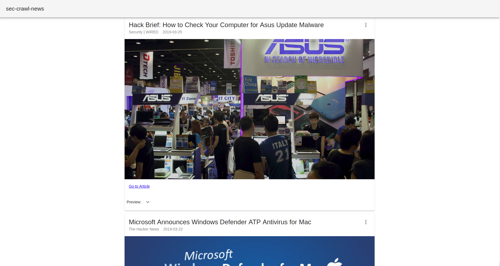

# sec-crawl-react
Simple React REST client of sec-crawl



## Requirements
  - sec-crawl https://github.com/bobctr/sec-crawl
  - npm
  - @material-ui/core
  - @material-ui/icons

## Setup
  Follow the instructions on the sec-crawl README to initialize the MongoDB instance, the REST service and to populate the database with the crawler itself.
  After that, you can quickly test it in development mode with
  ```
  npm install
  npm start
  ```
